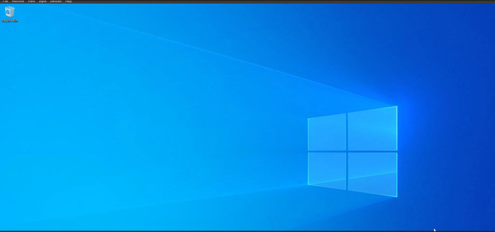
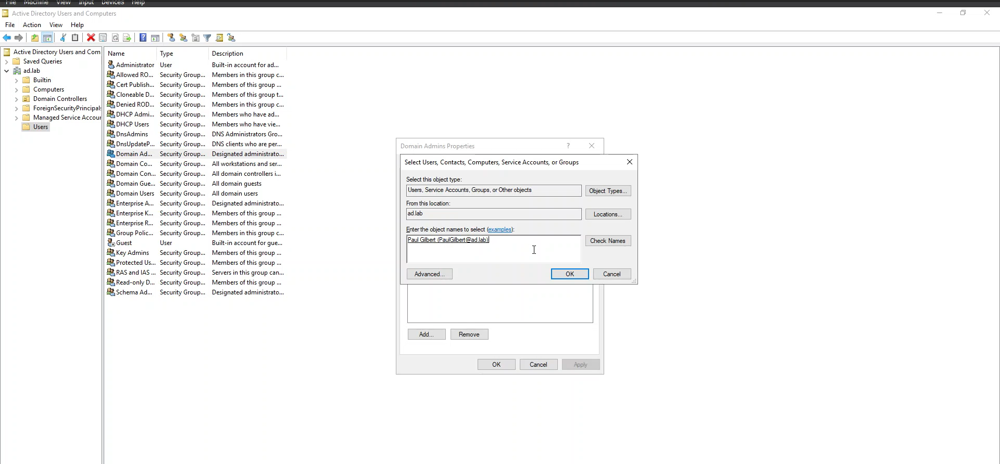

# Active Directory Penetration Testing

## Project Overview
This documentation provides a step-by-step guide to setting up an Active Directory (AD) lab environment using virtualization software. This lab will help gain hands-on experience with AD concepts, including user and group management, Group Policy Objects (GPOs), and network configuration.

## Prerequisites
- **Virtualization Software**: Oracle VirtualBox
- **ISO Files**: Windows Server 2019 and client Operating system (e.g. Windows 10 Enterprise)
- **Hardware Requirements**: Sufficient CPU, RAM, and disk space to run multiple VMs
- **Network Configuration**: Basic understanding of networking concepts

## Lab Set Up
### I. 💻 Setting Up the Virtual Environment
1. **Install Virtualization Software**:
   - Download and install Oracle VirtualBox from their respective websites.
   - Follow the installation instructions provided by the software vendor.

2. **Download ISO Files**:
   - Obtain the ISO files for Windows Server 2019 and Windows 10 Enterprise from the Microsoft website or a trusted source.

### II. 💻 Creating Virtual Machines (VMs)
#### Domain Controller (DC)
1. **Create a New VM**:
   - Open the virtualization software and create a new VM.
   - Select the Windows Server 2019 ISO file as the installation source.

*Ref 1: Windows Server Installation 1*

2. **Configure VM Settings**:
   - Allocate sufficient resources (CPU, RAM, and disk space) for the VM.

3. **Install Windows Server**:
   - Follow the installation process to set up Windows Server on the VM.

*Ref 2: Windows Server Installation 2*

*Ref 3: Windows Server Installation 3*

*Ref 4: Windows Server Installation*

*Ref 5: Windows Server Installation*

*Ref 6: Windows Server Installation*

*Ref 7: Windows Server Installation*

*Ref 8: Windows Server Installation*

#### Client Machines
1. **Create Client VMs**:
   - Repeat the process to create additional VMs for client machines using the Windows 10 Enterprise ISO file.

*Ref 9: Windows 10 Enterprise Installation*

*Ref 10: Windows 10 Enterprise Installation*

*Ref 11: Windows 10 Enterprise Installation*

*Ref 12: Windows 10 Enterprise Installation*

### III. 💻 Installing and Configuring Active Directory
#### Install Active Directory Domain Services (AD DS)
1. **Open Server Manager**:
   - On the Domain Controller VM, open Server Manager and select “Add roles and features".

2. **Add AD DS Role**:
   - Follow the wizard to install the Active Directory Domain Services role.

*Ref 13: Configuring Active Directory Domain Services*

*Ref 14: Configuring Active Directory Domain Services*

3. **Promote Server to Domain Controller**:
   - After the installation, use the “Promote this server to a domain controller” option.
   - Create a new forest and domain (e.g., ad.lab).

*Ref 15: Configuring Active Directory Domain Services*

*Ref 16: Configuring Active Directory Domain Services*

*Ref 17: Configuring Active Directory Domain Services*

*Ref 18: Configuring Active Directory Domain Services*

*Ref 19: Configuring Active Directory Domain Services*

*Ref 20: Configuring Active Directory Domain Services*

*Ref 21: Configuring Active Directory Domain Services*

*Ref 22: Configuring Active Directory Domain Services*

#### Configure DNS
1. **Install DNS Role**:
   - During the AD DS installation, ensure the DNS role is also installed.

*Ref 23: Configuring DNS*

2. **Configure DNS Settings**:
   - Verify that the DNS server is correctly configured to handle domain name resolution for the lab network.

*Ref 24: Configuring DNS*

#### Create Organizational Units (OUs)
1. **Open Active Directory Users and Computers**:
   - Use the AD management tools to create OUs for organizing users, groups, and computers.

2. **Create Users**:
   - Create Users and assign the password.

*Ref 25: Creating Users*
       

#### Making AD lab Vulnerable
- Open PowerShell as administrator and execute the following commands in powershell.

*Ref 26: AD Vulnerable*

 

#### Set Up Group Policy Objects (GPOs)
1. **Open Group Policy Management**:
   - Use the Group Policy Management Console to create and manage GPOs.

*Ref 27: Configuring GPO*

*Ref 28: Configuring GPO*

2. **Create and Link GPOs**:
   - Create GPOs to enforce security policies and link them to the appropriate OUs.

### IV. 💻 Joining Client Machines to the Domain
1. **Network Configuration**:
   - Ensure all VMs are on the same virtual network.

2. **Join Client Machines to the Domain**:
   - On each client machine, open System Properties and use the “Change settings” option to join the domain (e.g., ad.lab).

*Ref 29: Joining Windows 10 to AD Domain*
        

### V. 💻 Active Directory Penetration testing
1. **LLMNR Poisoning**

*Ref 30: LLMNR Poisoning*
     

2. **Cracking the password**

*Ref 31: Cracking the password*
 

3. SharpHound - Extracting the AD Domain Information

*Ref 32: Cracking the password*

4. **BloodHound Demo**

*Ref 33: Cracking the password*
       

